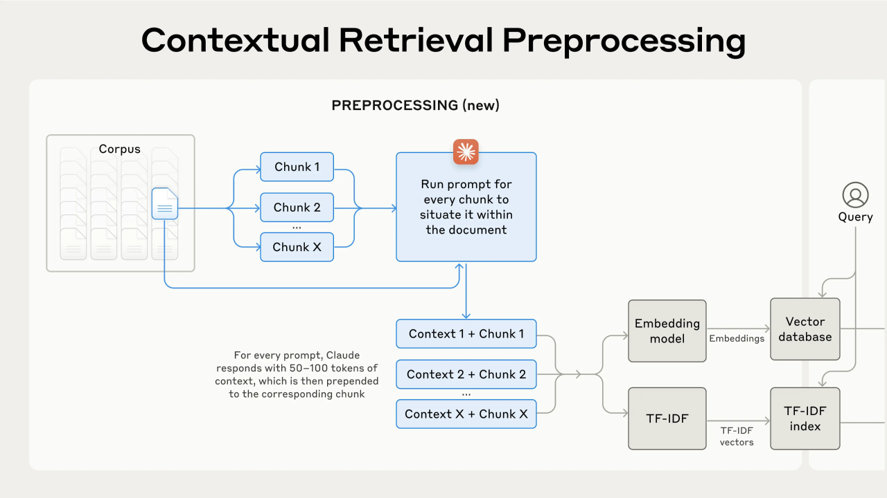
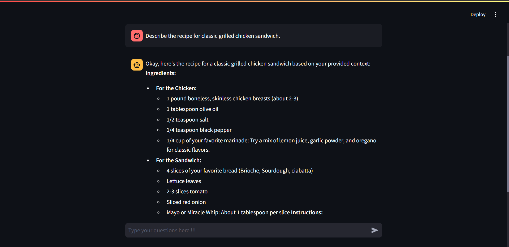
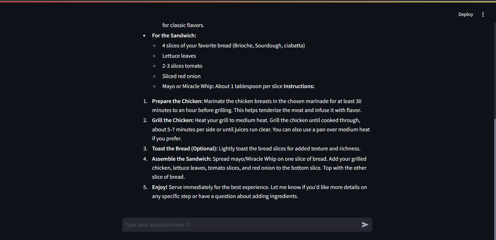
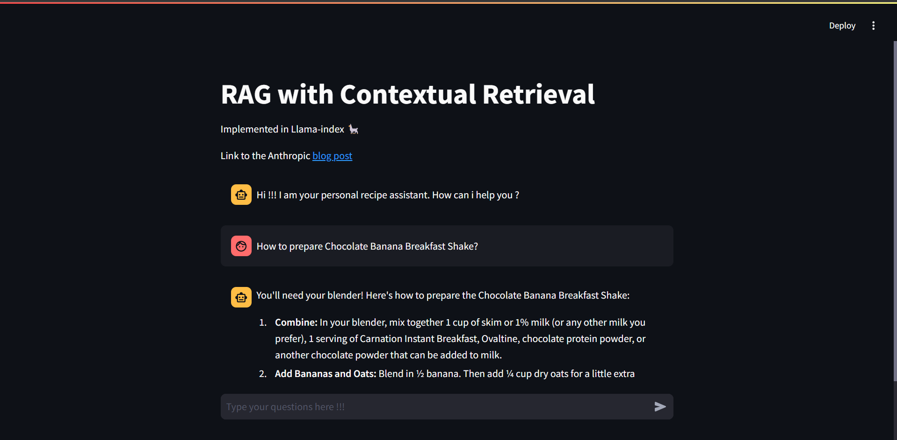
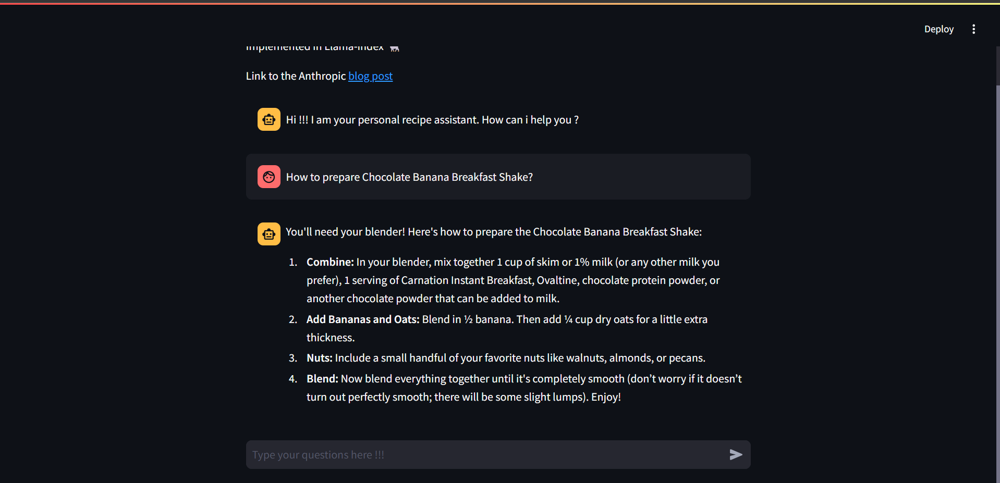

# Contextual Retrieval with Llama-Index (Anthropic)


This repository provides an implementation of [contextual retrieval](https://www.anthropic.com/news/contextual-retrieval), a novel approach that enhances the performance of retrieval systems by incorporating chunk-specific explanatory context. By prepending contextual information to each chunk before embedding and indexing, this method improves the relevance and accuracy of retrieved results.

### Key Technologies

- **Llama-Index:** A powerful framework for building semantic search applications.
- **Ollama:** A local LLMs serving solution, using the gemma2:2b model.
- **Streamlit:** A Python framework for building interactive web applications.
- **FastAPI:** A high-performance API framework for building web applications.
- **ChromaDB:** A vector database for efficient storage and retrieval of high-dimensional embeddings.

### Examples

Example 1:



Example 2:



### Setup

Clone the GitHub repo
```shell
git clone https://github.com/RionDsilvaCS/contextual-retrieval-by-anthropic.git
```
```shell
cd contextual-retrieval-by-anthropic
```

Create Python `env` and run `requirements.txt` file
```shell 
pip install -r requirements.txt
```

Create a directory `data` and add all the PDF's there
```shell
mkdir data
```

Create `.env` file and add below variables. 
```shell
DATA_DIR="./data"
SAVE_DIR="./src/db"
VECTOR_DB_PATH="./src/db/cook_book_db_vectordb"
BM25_DB_PATH="./src/db/cook_book_db_bm25"
COLLECTION_NAME="add_collection_name"
API_URL="http://127.0.0.1:8000/rag-chat"
```

Run Python file `create_save_db.py` to create ChromaDB and BM25 databases 
```shell
python create_save_db.py
```

### Run the application 

Begin with running `Ollama` in separate terminal 
```shell
ollama serve
```

Run the python file `app.py` to boot up FastAPI server
```shell
python app.py
```

Run the python file main.py to start streamlit app
```shell
streamlit run main.py
```

### Additional Information

- **Contextual Embedding:** The process of prepending chunk-specific explanatory context to each chunk before embedding.
- **Contextual BM25:** A modified version of BM25 that incorporates contextual information for improved relevance scoring.

----
### Follow me

>GitHub [@RionDsilvaCS](https://github.com/RionDsilvaCS)  ·  Linkedin [@Rion Dsilva](https://www.linkedin.com/in/rion-dsilva-043464229/)   ·  Twitter [@Rion_Dsilva_CS](https://twitter.com/rion_dsilva_cs)
